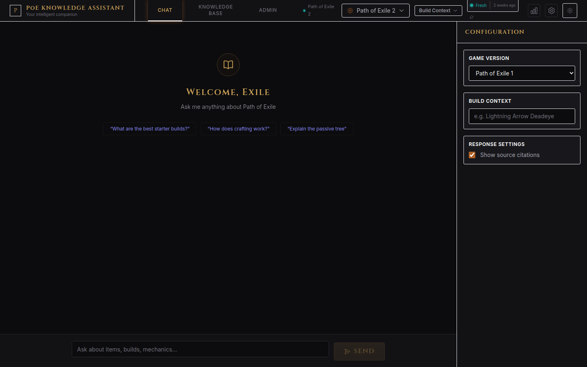
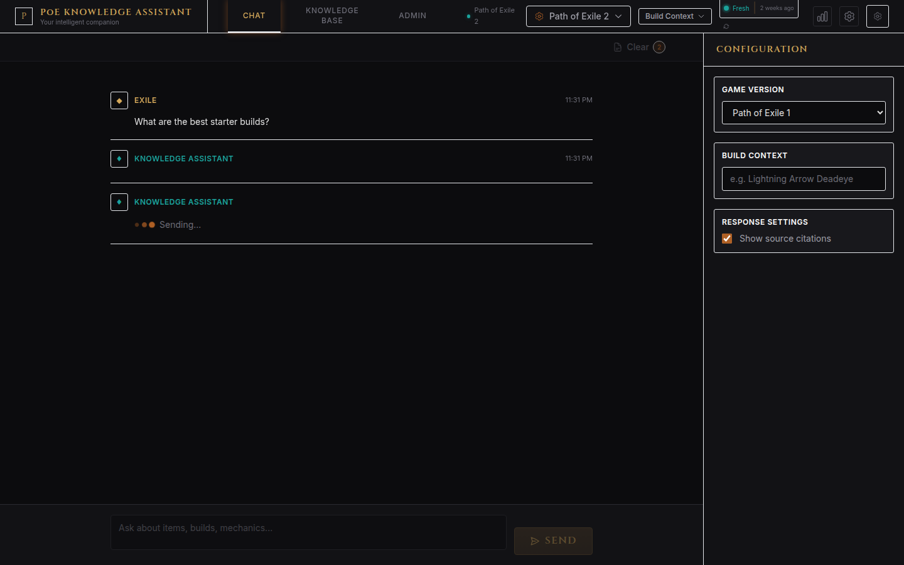
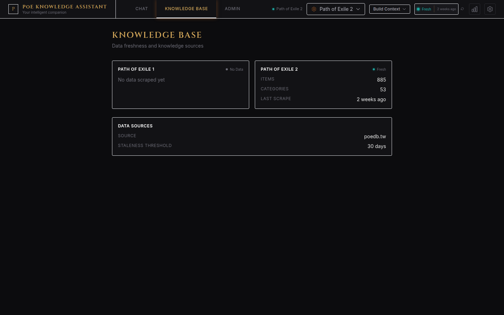
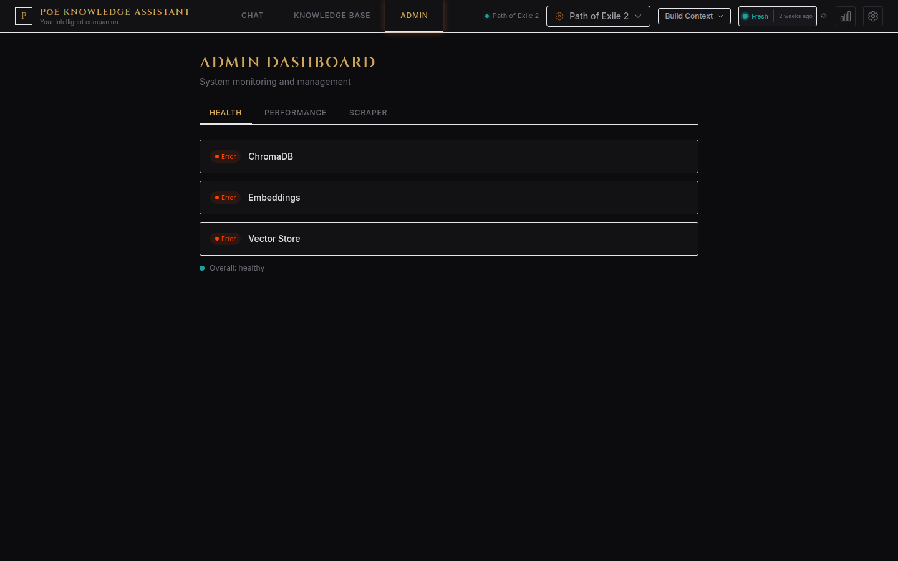
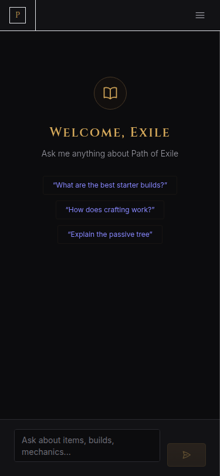

# PoE Knowledge Assistant

An AI-powered knowledge assistant for Path of Exile that uses RAG (Retrieval-Augmented Generation) to answer questions about game mechanics, items, builds, and strategies. Scrapes data from poedb.tw and provides contextual, game-version-aware responses through a dark-themed chat interface.



## Showcase

<table>
<tr>
<td width="50%"><br/><b>Chat with RAG-powered responses</b></td>
<td width="50%"><br/><b>Configure LLM & embedding providers</b></td>
</tr>
<tr>
<td width="50%"><br/><b>Browse and search the knowledge base</b></td>
<td width="50%"><br/><b>Admin scraper & job management</b></td>
</tr>
</table>

<details>
<summary><b>Mobile view</b></summary>

</details>

## Features

- **Dual Game Support** — Separate knowledge bases for PoE1 and PoE2 with metadata filtering
- **RAG Pipeline** — ChromaDB vector store with semantic search and citation extraction
- **Build Context** — Class/Ascendancy-aware recommendations (SSF, HC, Budget, Ruthless, PvP)
- **Item Cards** — Rich item display with PoE-style rarity colors, stats, and modifiers
- **Multi-LLM Support** — OpenAI, Anthropic, Ollama, LM Studio (switchable at runtime)
- **Scraper** — Automated poedb.tw scraper with job queue, rate limiting, and progress tracking
- **Real-Time Streaming** — SSE-based token streaming for chat responses
- **PoE Theme** — Custom Tailwind CSS theme matching the game's dark aesthetic

## Quick Start

### Prerequisites

- Python 3.10+
- Node.js 18+

### Backend

```bash
cd backend
python3 -m venv venv
source venv/bin/activate
pip install -r requirements.txt
cp .env.example .env
# Edit .env — set PROVIDER and your API key
uvicorn src.main:app --reload --host 0.0.0.0 --port 8460
```

### Frontend

```bash
cd frontend
npm install
npm run dev
```

### Access

| URL | Description |
|-----|-------------|
| http://localhost:9460 | Frontend application |
| http://localhost:8460/docs | Swagger API docs |
| http://localhost:8460/redoc | ReDoc API docs |

## Configuration

The app is configured through `backend/.env`. Key options:

```ini
# LLM Provider (openai | anthropic | ollama | lmstudio)
PROVIDER=openai
OPENAI_API_KEY=sk-your-key-here

# Or use Anthropic
PROVIDER=anthropic
ANTHROPIC_API_KEY=sk-ant-your-key-here

# Or use local Ollama (free, no API key)
PROVIDER=ollama
OLLAMA_BASE_URL=http://localhost:11434

# Embeddings (local | openai | ollama | lmstudio)
EMBEDDING_PROVIDER=local
```

See [`backend/.env.example`](backend/.env.example) for the full reference.

## Tech Stack

| Layer | Technologies |
|-------|-------------|
| **Backend** | FastAPI, LangChain, ChromaDB, SQLAlchemy, BeautifulSoup |
| **Frontend** | React 18, TypeScript, Vite, Tailwind CSS |
| **Embeddings** | sentence-transformers (local), OpenAI, Ollama |
| **Testing** | Playwright (E2E), Vitest (unit), pytest |

## Project Structure

```
poe-knowledge-assistant/
├── backend/
│   ├── src/
│   │   ├── main.py              # FastAPI app & API routes
│   │   ├── config.py            # Environment configuration
│   │   ├── models/              # Pydantic request/response models
│   │   └── services/
│   │       ├── rag_chain.py     # RAG retrieval chain
│   │       ├── chroma_db.py     # ChromaDB manager
│   │       ├── embeddings.py    # Embedding providers
│   │       ├── llm_provider.py  # LLM providers
│   │       ├── scraper/         # Web scraping modules
│   │       ├── indexer.py       # Document indexer
│   │       ├── streaming.py     # SSE streaming
│   │       └── job_manager.py   # Scraping job queue
│   ├── requirements.txt
│   └── .env.example
├── frontend/
│   ├── src/
│   │   ├── components/          # React components
│   │   ├── hooks/               # Custom React hooks
│   │   ├── lib/                 # API client
│   │   └── types/               # TypeScript types
│   ├── package.json
│   └── vite.config.ts
├── docs/                        # Deployment & operations docs
└── README.md
```

## Documentation

| Document | Description |
|----------|-------------|
| [Local Development](docs/local-development.md) | Setting up a dev environment |
| [Deployment Guide](docs/deployment.md) | Deployment overview |
| [Production Deployment](docs/production-deployment.md) | Production server setup |
| [Docker Configuration](docs/docker.md) | Docker & Docker Compose |
| [Environment Management](docs/environment-management.md) | Environment variable reference |
| [Reverse Proxy Setup](docs/reverse-proxy.md) | Nginx configuration |
| [Monitoring & Logging](docs/monitoring.md) | Health checks & alerting |
| [Troubleshooting](docs/troubleshooting.md) | Common issues & solutions |

## API Endpoints

| Method | Endpoint | Description |
|--------|----------|-------------|
| GET | `/api/health` | Health check (ChromaDB, embeddings, vector store) |
| POST | `/api/chat/stream` | Streaming chat with RAG (SSE) |
| GET/PUT | `/api/config` | Get/update runtime configuration |
| GET | `/api/freshness` | Data freshness timestamps |
| POST | `/api/admin/scrape` | Trigger scraping job |
| GET | `/api/admin/scrape/status` | Scrape job status |
| POST | `/api/embeddings/embed` | Test embeddings |
| POST | `/api/vectorstore/search` | Vector similarity search |
| GET | `/api/llm/providers` | List available LLM providers |
| GET | `/api/performance` | Performance metrics |

## License

MIT License — see [LICENSE](LICENSE) for details.
